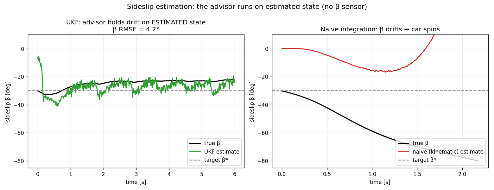
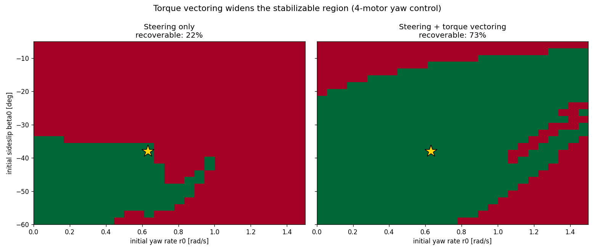
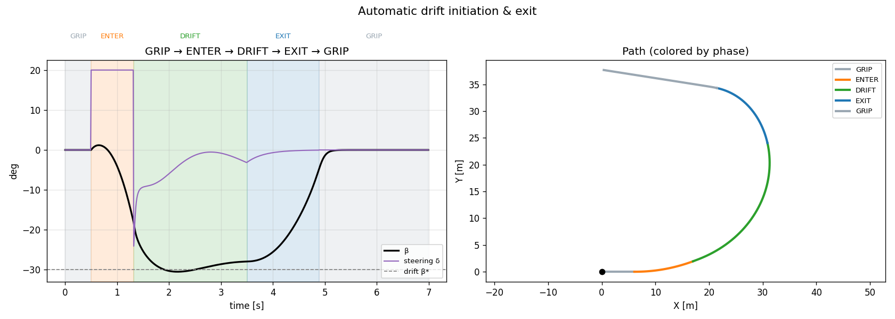
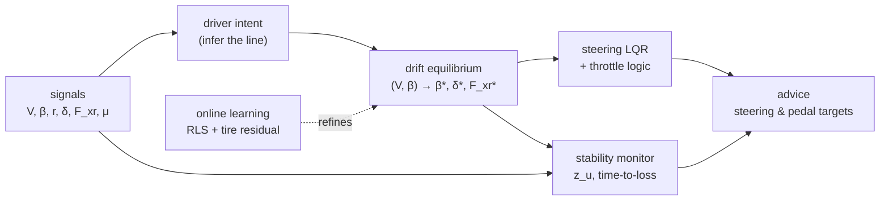

# 🏎️ Drift Sweet-Spot Advisor

**A real-time co-pilot that keeps a car in a drift.** It watches a 4-motor EV mid-slide and
tells the driver — every 10 ms — exactly **how to move the steering wheel and accelerator** to
hold the drift and not spin, blending vehicle-dynamics control with online machine learning.

### ▶ [Play it in your browser](https://vatsalparikh96.github.io/ideal-drift-calculator/) — no install

*The full advisor, compiled to WebAssembly (pygbag): arrow keys to drive, **SPACE** for autopilot.*


*Drive it yourself — the HUD shows the advisor's steering and pedal **targets**, a stability
margin, and a live β–r phase dot. Here the driver over-throttles, the advisor flashes
**LIFT + countersteer**, and the drift is saved.*

---

## Why it's interesting

A steady-state drift is an **open-loop-unstable equilibrium** of the vehicle dynamics — left
alone it diverges into a spin or washes out. Holding it requires active stabilizing feedback.
This project computes that feedback law in real time and **shows it to the driver** instead of
taking over.

The headline result, measured by sweeping thousands of initial drift states:

> **The advisor expands the recoverable region from 7% of drift states to 88%.**


The user's exact scenario — *too much throttle mid-drift* — is **friction-circle coupling**:
extra rear drive force eats the rear tire's lateral grip (`F_yr_max = √((μ·F_zr)² − F_xr²)`),
yaw runs away, the car spins. The physics-derived fix is exactly **lift throttle + countersteer**:


*Ignore the advice → spin (1.9 s). Brief mistake then obey → recover. Always assist → hold.*

---

## The two sides of the project

**Vehicle dynamics / control** — the drift is an unstable equilibrium stabilized by steering:


**Machine learning / adaptation** — the advisor's tire model self-calibrates online. Recursive
least squares recovers the true cornering stiffness from sub-limit driving, and a small learned
residual captures tire-curve shape the physics model misses (lateral-force RMSE **−56%** vs a
Pacejka reference). Crucially, the controller is *robust* to model error (recovery unchanged
under ±40% stiffness error), so learning is a **refinement, never a stability crutch**:


**State estimation (no sideslip sensor)** — a real car can't measure sideslip cheaply, so an
**Unscented Kalman Filter** estimates the full state `[v_x, v_y, r]` (and an accelerometer bias)
from noisy IMU + wheel-speed measurements, using the single-track model as the process model.
It tracks β to **~4° RMSE** and the advisor holds the drift on the *estimated* state — while
naive dead-reckoning, fooled by accelerometer bias, spins:



**Torque vectoring (the 4-motor advantage)** — a left/right rear torque split adds a yaw moment
`M_z` with *direct* yaw authority (unlike rear drive force at a saturated rear). As a second
control input it widens the stabilizable region dramatically in a demanding regime (lower grip,
deep drift, limited ±20° steering): **recoverable states 22% → 73%**:



**Automatic drift initiation & exit** — a state machine (GRIP → ENTER → DRIFT → EXIT → GRIP)
wraps the LQR core: a throttle-stab "kick" breaks the rear and lands the state inside the
controller's basin, the LQR captures and holds the drift, then a lift-and-unwind exit returns
the car to grip — a full maneuver, not just holding:



---

## Run it

```bash
pip install -e ".[interactive]"      # or: pip install -r requirements.txt

drift-drive                          # 🎮 drive it yourself (keyboard)
drift-demo                           # scenario comparison + animated HUD
drift-figures                        # regenerate the phase portrait + basin map
drift-learn                          # regenerate the learning experiment
python -m experiments.estimation_eval        # UKF sideslip estimation result
python -m experiments.torque_vectoring       # torque-vectoring basin comparison
python -m scenarios.drift_entry_exit         # automatic drift initiation + exit
python -m experiments.robustness             # robustness sweeps + loop-time budget
pytest                               # run the test suite (45 tests)
```

Controls: **←/→** steer · **↑** throttle · **↓** brake · **SPACE** autopilot · **R** reset.

**Play in the browser locally** (compile to WebAssembly with [pygbag](https://pygame-web.github.io)):

```bash
pip install pygbag
python web/build.py                  # -> web/_app/build/web/
python -m http.server -d web/_app/build/web   # then open http://localhost:8000
```

The browser build runs the **identical** control law: the two SciPy calls (Riccati/LQR and the
equilibrium root-find) fall back to NumPy-only implementations (`control/_numerics.py`, pinned to
SciPy in `tests/test_numerics.py`), so the WASM bundle ships NumPy alone. GitHub Pages is deployed
automatically by `.github/workflows/pages.yml`.

---

## How it works



| Module | Role |
|---|---|
| `sim/vehicle_model.py`, `control/tire.py` | Single-track plant + C1 fully-derated **Fiala** tire (friction circle) |
| `control/equilibria.py` | Robust **(V, β)** drift-equilibrium solver + feasibility gate |
| `control/stability.py` | Linearization, eigen-analysis, left/right unstable eigenvectors |
| `control/corrector.py` | **Steering-only LQR** + friction-circle throttle advice |
| `control/stability_monitor.py` | Signed unstable-mode coordinate `z_u`, over/understeer, time-to-loss |
| `control/drift_sequence.py` | State machine for automatic drift initiation & exit |
| `intent/trajectory.py` | Infer the driver's intended drift (latched, hysteresis, frozen while diverging) |
| `estimation/ukf.py` | Unscented Kalman Filter: sideslip + accelerometer-bias estimation |
| `estimation/rls.py`, `learning/tire_residual.py` | Gated online stiffness RLS + learned tire residual |
| `realtime/loop.py` | 100 Hz orchestrator (equilibrium re-solve decimated to 20 Hz) |
| `hmi/display.py`, `interactive/drive.py` | HUD + the drive-it-yourself sim |

**Why steering-only LQR?** At a saturated rear, the throttle's *linear* yaw authority is ~0
(`B[:,F_xr] ≈ 1/m`, pure speed) — so steering is the only fast lateral actuator, and throttle is
the *spin trigger* handled by the nonlinear friction-circle logic. This emerged from numerically
verifying the model, not from assumption.

### Sign convention (ISO 8855)
`x` forward, `y` left, `r>0` = left turn, `β = atan2(v_y, v_x)`, `δ>0` = steer left. A **left
drift** has `r>0, β<0`, countersteer `δ<0`. Pinned in `config/params.py` and unit-tested — a
wrong sign inverts every cue.

---

## Engineering

Typed (`mypy` clean), linted (`ruff`), **~95% test coverage** across 36 tests (tire C0/C1
continuity, sign conventions, equilibrium branch selection, open-loop instability, UKF
convergence + bias rejection, torque-vectoring authority, drift entry/exit, RLS convergence,
end-to-end scenario), CI on Python 3.10–3.12 (`.github/workflows/ci.yml`), `pip`-installable
with console entry points.

## Limitations & the path to a real car

* Single-track lumps left/right, so it omits the 4-motor torque-vectoring yaw moment (correct
  for analysis/advice, conservative for the real plant).
* The front cornering stiffness is tuned soft so the front keeps steering authority at the drift
  point (pure Fiala has a flat post-peak; real tires don't).
* Python proves the physics/control/learning; a car needs an RTOS port and, in reality, a
  dual-antenna RTK-GNSS+IMU to *measure* sideslip (here it is given). LQR holds one equilibrium;
  transitions and general paths would use NMPC / nonlinear model inversion.

**Full technical write-up:** [docs/REPORT.md](docs/REPORT.md) (incl. a German Kurzfassung).

**References:** Hindiyeh & Gerdes 2014; Goh, Goel & Gerdes 2020; Velenis et al.; learned-tire
drift work (Djeumou et al. 2023; Broadbent et al. 2024).
