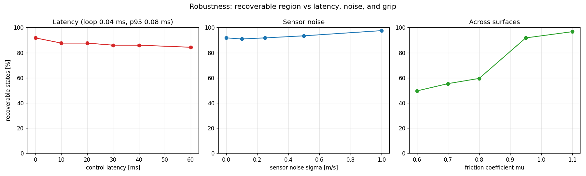

# Real-Time Drift Sweet-Spot Advisor — Technical Report

**Author:** Vatsal Parikh · **Code:** [github.com/vatsalparikh96/ideal-drift-calculator](https://github.com/vatsalparikh96/ideal-drift-calculator)

## Abstract

A drift — sustained, controlled oversteer — is a steady state of the vehicle dynamics that
is *open-loop unstable*: without continuous correction the car spins or washes out. This
project builds a real-time advisor that, for a 4-motor electric vehicle, computes the
stabilizing feedback and presents it to the driver as live steering and pedal **targets**.
The core is a drift-equilibrium **LQR** on a nonlinear single-track model with a friction-
circle tire; around it sit an **Unscented Kalman Filter** for sideslip estimation, a
**torque-vectoring** extension that uses the four motors' differential yaw moment, an
automatic **drift initiation/exit** state machine, and a gated **online tire-learning**
layer. Measured outcomes: the advisor expands the recoverable set of drift states from
**7% to 88%**; sideslip is estimated to **~4° RMSE** without a dedicated sensor; torque
vectoring lifts the recoverable region from **22% to 73%** in a demanding regime; and the
fast control loop runs in **~0.04 ms**, ~250× under the 10 ms (100 Hz) budget.

## Kurzfassung (DE)

Ein Drift ist ein *offen instabiler* Gleichgewichtszustand der Fahrzeugdynamik und muss
aktiv stabilisiert werden. Dieses Projekt berechnet in Echtzeit das stabilisierende
Regelgesetz (LQR um das Drift-Gleichgewicht eines nichtlinearen Einspurmodells mit
Reibkreis-Reifenmodell) und zeigt dem Fahrer Lenk- und Pedal-**Sollwerte** an. Ergänzt um
ein **Unscented-Kalman-Filter** (Schwimmwinkel-Schätzung ohne Sensor, ~4° RMSE),
**Torque-Vectoring** (Giermoment der vier Motoren) und automatische **Drift-Einleitung/-
Beendigung**. Der stabilisierbare Zustandsbereich steigt von **7% auf 88%**; die schnelle
Regelschleife läuft in **~0,04 ms** (100-Hz-Budget: 10 ms).

---

## 1. Vehicle model

**Convention (ISO 8855):** `x` forward, `y` left, `z` up; yaw rate `r > 0` is a left turn;
sideslip `β = atan2(v_y, v_x)`; steer `δ > 0` is left. A left-hand drift therefore has
`r > 0`, `β < 0`, and countersteer `δ < 0`. Getting a sign wrong inverts every cue, so the
convention is pinned in code and unit-tested.

**Single-track (bicycle) dynamics**, front/rear axles lumped, state `[v_x, v_y, r]`:

```
m(v̇_x − v_y r) = F_xr + F_xf cosδ − F_yf sinδ − F_aero
m(v̇_y + v_x r) = F_yf cosδ + F_xf sinδ + F_yr
I_z ṙ          = a(F_yf cosδ + F_xf sinδ) − b F_yr + M_z
```

`M_z` is an external yaw moment from torque vectoring (§5; zero in the base model).

**Tire model — C1 fully-derated Fiala (friction circle).** A linear `F_y = −C_α α` model
is useless here because the rear is saturated. We use a brush/Fiala lateral force whose
friction limit is reduced by the longitudinal force actually used, via a friction **circle**
(single `μ` per axle):

```
η = √(max(0, (μ F_z)² − F_x²))        # remaining lateral budget (= F_y,max)
α_sl = atan(3η / C_α)
|tanα| < 3η/C_α :  F_y = −C_α tanα + (C_α²/3η)|tanα|tanα − (C_α³/27η²)tan³α
otherwise       :  F_y = −η·sign(α)
```

This is **C0 and C1 continuous** at `α_sl`. Continuity matters because the controller takes
Jacobians through this function: a hard saturation clamp has a zero gradient that *fakes*
marginal stability at exactly the saturated operating point. Load transfer uses the body-
frame longitudinal acceleration, `F_zf = (mgb − m a_x h)/L`, `F_zr = (mga + m a_x h)/L`.

## 2. Drift equilibria and instability

A steady drift uses essentially all of the lateral grip, so the path radius is set by speed
(`R ≈ V²/μg`); sideslip `β` is the (near-free) drift-angle parameter. We therefore
parameterize equilibria by **(V, β)** — which is well-conditioned — and solve
`v̇_x = v̇_y = ṙ = 0` for `(δ*, F_xr*, r*)` with a branch-aware solver that selects the
rear-saturated / front-authority root and gates infeasible targets.

Linearizing the full 3-state dynamics at the equilibrium yields a Jacobian with at least one
right-half-plane eigenvalue — the drift is **open-loop unstable** (a saddle in the reduced
2-D `(β, r)` phase plane). The phase portrait and the open- vs closed-loop trajectories make
this concrete:


## 3. Stabilizing control → advice

We use a **steering-only LQR** on the full state plus a separate throttle law. The reason is
structural and was verified numerically: at a saturated rear the throttle column of `B` has
~zero lateral/yaw authority (`B[:,F_xr] ≈ 1/m`, pure speed), so an LQR that tries to
stabilize yaw with throttle produces explosive, useless gains. Steering is the only fast
lateral actuator:

```
δ = δ* − K (x − x*)          # K is 1×3 (steering)
F_xr = F_xr* − k_v (v_x − v_x*)   # throttle: speed trim, anchored at the equilibrium drive force
```

The throttle's recovery role — the "lift" in the canonical too-much-throttle save — is the
*finite-amplitude* friction-circle effect (lifting unsaturates the rear and restores `F_yr`),
not a linear gain. Cues are presented as **targets** the driver moves toward; they retract as
the state returns to `x*`, which prevents the lift-plus-countersteer pendulum into the
opposite spin. Closing the loop expands the recoverable region from **7% to 88%**:


## 4. State estimation (no sideslip sensor)

A production car cannot cheaply measure sideslip, so the advisor must run on an *estimated*
state. An **Unscented Kalman Filter** estimates `[v_x, v_y, r]` plus a lateral-accelerometer
**bias** from noisy measurements `[r, v_x, a_x, a_y]`, using the single-track model as the
process model. The subtlety: at a saturated rear `dF_yr/dα_r → 0`, so lateral acceleration is
only weakly sensitive to `v_y` — sideslip is *weakly observable* in a deep drift. The UKF
nonetheless tracks `β` to **~4° RMSE** and, by estimating the accelerometer bias, rejects an
offset that makes naive dead-reckoning diverge and spin:


## 5. Torque vectoring (the 4-motor advantage)

A left/right rear torque split produces a yaw moment `M_z` that enters the yaw equation
directly (`B`-column `[0, 0, 1/I_z]`) — exactly the *direct yaw authority* that throttle
lacks at the limit. Added as a second control input to the LQR, it widens the stabilizable
region most where steering is weak or limited. In a demanding regime (μ = 0.8, β* = −38°,
realistic ±20° steering) the recoverable region rises from **22% (steering only) to 73%**:


## 6. Automatic drift initiation & exit

A state machine wraps the LQR core: **GRIP → ENTER → DRIFT → EXIT → GRIP**. ENTER applies an
open-loop "kick" (steer-in + throttle stab) only until the state lands inside the LQR's basin;
the stabilizer then captures and holds the drift; EXIT lifts and unwinds, letting restored
rear grip pull `β` back to zero. This turns "hold a drift" into a complete maneuver:


## 7. Online learning, robustness, and real-time

**Learning is a gated refinement, never load-bearing for stability.** Recursive least
squares estimates cornering stiffness in the linear regime (frozen at saturation, where it is
unidentifiable), and a small RBF residual captures tire-curve shape the brush model misses
(force RMSE −56% vs a Pacejka reference). Critically, the model-based controller is *robust*
to parameter error — recovery is essentially unchanged under ±40% stiffness error — so
learning improves model fidelity rather than rescuing stability.

**Robustness & budget.** The recoverable region degrades gracefully with control latency
(92% → 84% at 60 ms), is insensitive to sensor noise, and shrinks predictably on low-grip
surfaces. The fast control loop (`advise`) runs in **~0.04 ms (p95 0.08 ms)**, ~250× inside
the 10 ms / 100 Hz budget; the heavier equilibrium re-solve runs decimated at ~20 Hz.




## 8. Limitations & path to a vehicle

* The single-track model lumps left/right, so it is exact for analysis/advice but conservative
  for the real plant; the two-track torque-vectoring term is added as an external `M_z`.
* The front cornering stiffness is tuned soft so the front retains steering authority at the
  drift point (pure Fiala has a flat post-peak; real tires have a gentle descending slope).
* Python proves the physics, control, estimation, and learning; a vehicle needs an RTOS port
  and, realistically, dual-antenna RTK-GNSS + IMU for `β` (here estimated by the UKF). LQR
  holds one equilibrium; transitions along a general path call for nonlinear model inversion
  or NMPC.

## References

1. Hindiyeh & Gerdes, *A Controller Framework for Autonomous Drifting*, ASME J. Dyn. Sys.
   Meas. Control, 2014.
2. Goh, Goel & Gerdes, *Toward Automated Vehicle Control Beyond the Stability Limits:
   Drifting Along a General Path*, 2020.
3. Velenis et al., *Steady-state drifting stabilization of RWD vehicles*, Control Eng.
   Practice.
4. Djeumou et al., *Autonomous Drifting with 3 Minutes of Data via Learned Tire Models*,
   2023; Broadbent et al., *Neural Network Tire Force Modeling for Automated Drifting*, 2024.
